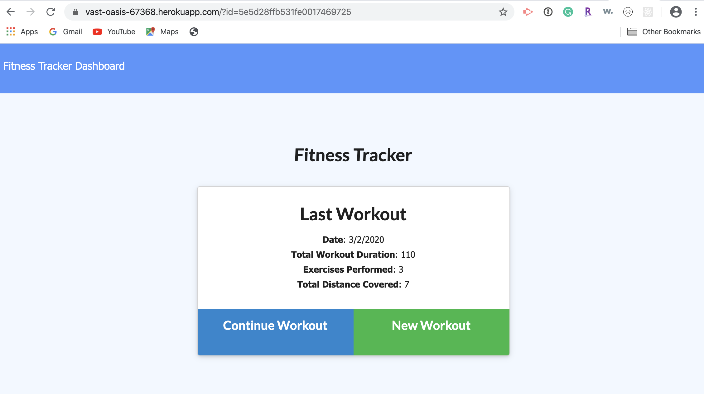
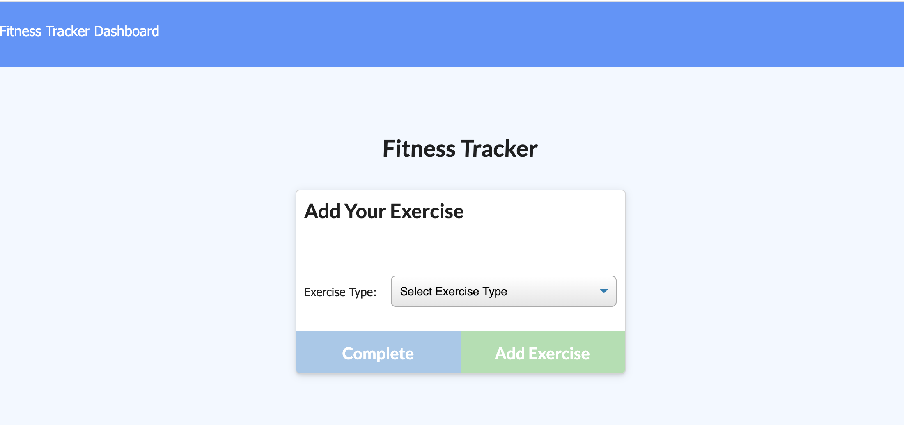
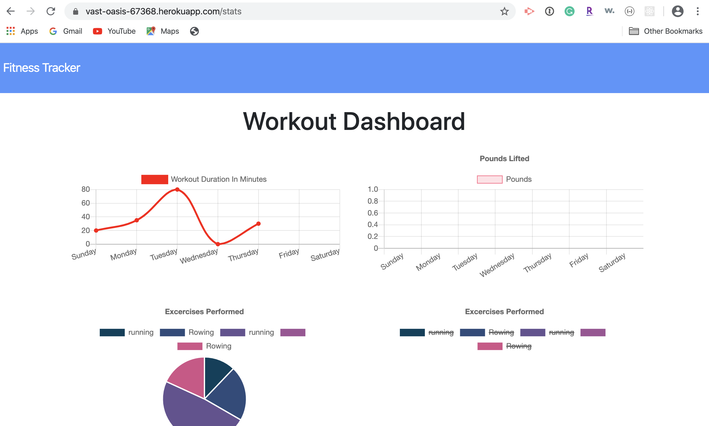

# fitness-tracker

## Use Story

As a user, I want to be able to view create and track daily workouts. I want to be able to log multiple exercises in a workout on a given day. I should also be able to track the name, type, weight, sets, reps, and duration of exercise. If the exercise is a cardio exercise, I should be able to track my distance traveled.

## Business Context

A consumer will reach their fitness goals quicker when they track their workout progress.

## Acceptance Criteria

When the user loads the page, they should be given the option to create a new workout, or continue with their last workout.

The user should be able to:

<ul>
<li>Add exercises to a previous workout plan.</li>

<li>Add new exercises to a new workout plan.</li>

<li>View multiple the combined weight of multiple exercises on the stats page.</li>

</ul>

## How to use

<ul>
<li>Once you clone the code, open and run an npm install to install the following packages:
    <ul>
    <li>express</li>
    <li>mongoose</li>
    <li>morgan</li>
    </ul>
</li>
<li>Once the npm packages are installed, you can run the app locally by typing run node server in the terminal.  The app will run on your local machine at port 3000.</li>
<li>Once on the app, you can view your last workout, continue your last workout, or add a new workout.  You can also view the dashboard to view the statistics of your workouts.</li>

## Live App

The live app is hosted on Heroku and can be viewed at: https://vast-oasis-67368.herokuapp.com

## Screen shots

Homepage

Add a workout page

Dashboard

